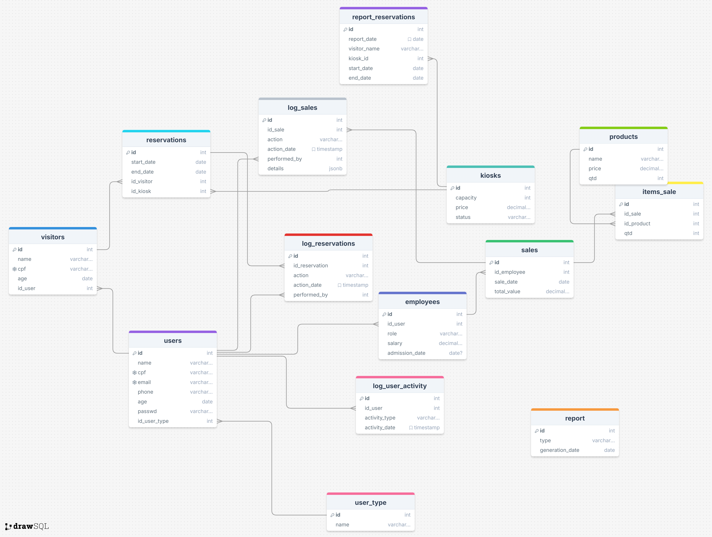

# 🌊 Balneário Águas Claras — Sistema de Gestão e Presença Digital

Bem-vindo ao repositório oficial do sistema de gestão do Balneário Águas Claras — um espaço de lazer familiar que agora se transforma em um dos pontos turísticos mais completos da região!

> Este projeto foi desenvolvido como desafio prático, com prazo de entrega entre os dias **09 e 16 de abril de 2025**.

---

## 📌 Visão Geral

O sistema foi criado para atender as seguintes demandas:

- Controlar reservas dos quiosques, churrasqueiras e áreas de camping
- Registrar visitantes e pessoas interessadas
- Gerenciar os produtos vendidos no bar
- Controlar vendas tendo controle do Funcionário responsável
- Fornecer relatórios e dashboards ao gestor para acompanhar o balanço financeiro
- Criar e apresentar a identidade virtual do Balneário
- Viabilizar o agendamento online por parte dos clientes
- Fornecer um sistema centralizado das informações do sistema aos visitantes e controle ao gestor

---

## 🧠 Nome e Identidade Visual

**Nome:** *Balneário Rancho da Capivara*

**Justificativa:** o nome “Balneário Rancho da Capivara” traz uma identidade única e regional, remetendo à fauna local e ao clima acolhedor do interior. A capivara, símbolo de tranquilidade e socialização, representa bem o espírito do balneário: um espaço de convivência, lazer e natureza para todos.

---

## 🌐 Navegação do Sistema

- **/customer**: Galeria de fotos, localização (via Google Maps), agendamento de reservas
- **/user**: Interface de atendimento, cadastro de visitantes, registro de vendas
- **/manager**: Painel administrativo com gráficos, relatórios e controle de dados

---

## 🏗️ Estrutura do Banco de Dados (PostgreSQL)

**Total: 8 tabelas principais**

| Tabela        | Descrição                                                                 |
|---------------|---------------------------------------------------------------------------|
| `usuarios`    | Login de funcionários e gestor, com nível de acesso                       |
| `quiosques`   | Dados dos quiosques (nome, capacidade, disponível ou não)                 |
| `reservas`    | Conecta visitantes a espaços reserváveis (quiosque, churrasqueira etc.)   |
| `visitantes`  | Nome, CPF, telefone, email (para contato e controle)                      |
| `produtos`    | Produtos do bar (nome, preço, categoria, imagem)                          |
| `vendas`      | Registro das vendas realizadas (produto, quantidade, valor, funcionário)  |
| `relatorios`  | Resumo de movimentações semanais e mensais                                |

**Relacionamentos-chave:**

- `reservas` → `visitantes` e `quiosques`
- `vendas` → `produtos` e `usuarios`
- `usuarios` → usado para login dos funcionários e do gestor

## 🗂️ Diagrama Entidade-Relacionamento (DER)

Abaixo está o Diagrama Entidade-Relacionamento (DER) que representa visualmente a estrutura do banco de dados do *Balneário Rancho da Capivara*.

> 🔍 O DER mostra nossas principais tabelas e relacionamentos
---

## 🛠️ Tecnologias Utilizadas

| Camada         | Tecnologia                         |
|----------------|-------------------------------------|
| Back-end       | ASP.NET Core com Entity Framework   |
| Banco de Dados | PostgreSQL                          |
| Front-end      | HTML, CSS, JavaScript               |
| Organização    | Trello (kanban com tarefas e prazos)|

---

## 📋 Funcionalidades do Sistema

### 👤 Cliente (/cliente)
- Visualização da galeria de fotos do local
- Visualização do mapa com localização no Google Maps
- Agendamento de reservas online

### 👨‍🍳 Funcionário (/funcionario)
- Registro de visitantes no sistema
- Cadastro e edição de reservas
- Registro de vendas do bar

### 📊 Gestor (/gestor)
- Cadastro de produtos e funcionários
- Upload de novas imagens para a galeria
- Painel com gráficos de vendas e movimentação
- Relatórios filtráveis por data, produto, funcionário

---
### Responsáveis

  
  
  
  
  
  
  